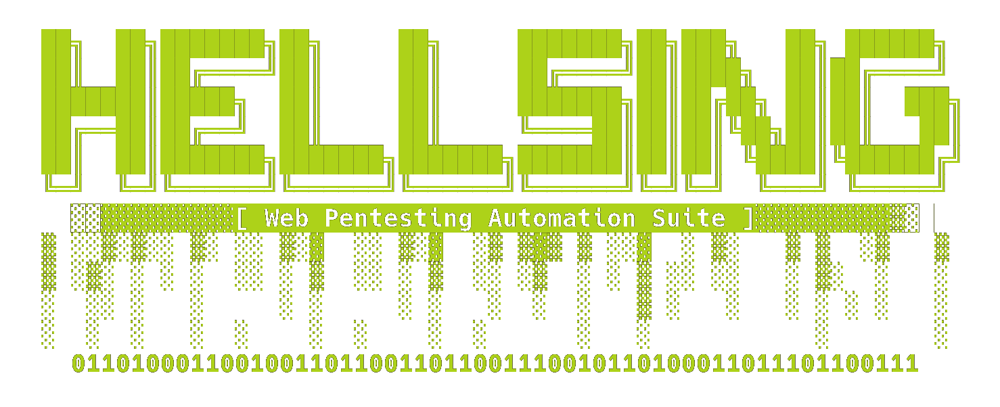

<p align="center" id="imageContainer">
    
</p>

<div align="center">
    <!-- <h1>
        HELLSING
        <br>
        Web Pentesting Automation Suite
    </h1> -->
    <br>
</div>
<br>

# `HELLSING`
**A Web Pentesting Automation Suite**

<!-- # Tools and Languages Used
`python` 
`bash`
`kali`
`regex`
`vscode` -->


# `Introduction`

**hellsing.py** is a web penetration testing automation CLI tool which
is created using Python3 language.

It\'s integrating more than 40+ open-source CLI tools and various
scripts. Designed for both security professionals and passionate
enthusiasts, it offers a streamlined approach to web security testing.
From probing the digital fortress to exploit web systems upon
vulnerabilities.

Hellsing.py is a comprehensive arsenal for security assesment as it is
designed to automate the process of security testing and it helps the
security professionals to save time and effort of manually testing the
security of web applications.


# `Features`

## Pentest Toolbox management

-   **Install, update, uninstall and check the status of the tools in
    the toolbox.**
-   **Install all the tools in the toolbox.**
-   **Install specific tool(s) in the toolbox.**
-   **Update all the tools in the toolbox.**
-   **Update specific tool(s) in the toolbox.**
-   **Uninstall all the tools in the toolbox.**
-   **Uninstall specific tool(s) in the toolbox.**
-   **Check the status of all the tools in the toolbox.**
-   **Check the operational status of the tools in the toolbox.**

## Web Security Assessment

-   **Run all security checks against a URL.**
-   **Run all security checks against an IP address.**
-   **Specify the target port.**
-   **Run only checks in specified category(ies).**
-   **Run all checks except the ones in specified category(ies).**
-   **Run security checks using a pre-defined attack profile.**


# `Architecture`

<p align="center">
    
</p>


# `Installation`

### To install just clone the git repository and run the setup script.

1.  **Clone the git repository:**

    > ``` console
    > git clone https://github.com/d3ttl4ff/hellsing.git
    > ```

2.  **Run the dependency installation script:**

    > ``` console
    > cd hellsing
    > sudo ./install.sh
    > ```

3.  **Run the tool:**

    > ``` console
    > python3 hellsing.py -h
    > ```


# `Update`

1.  **In order to update, just pull the latest version of the tool from
    git repository.**

    > ``` console
    > sudo git pull
    > ```


# `Commands`

## Debugging

-   Show options (help):

``` console
python3 hellsing.py -h
```

## Toolbox Management

-   Show toolbox help menu:

``` console
python3 hellsing.py toolbox -h
```

-   Show all the tools in the toolbox:

``` console
python3 hellsing.py toolbox --show-all  
```

-   Install all the tools in the toolbox:

``` console
python3 hellsing.py toolbox --install-all
```

-   Install specific tool(s) in the toolbox:

``` console
python3 hellsing.py toolbox --install tool1,tool2,… 
```

-   Update all the tools in the toolbox:

``` console
python3 hellsing.py toolbox --update-all
```

-   Update specific tool(s) in the toolbox:

``` console
python3 hellsing.py toolbox --update-tool tool1,tool2,…
```

-   Uninstall all the tools in the toolbox:

``` console
python3 hellsing.py toolbox --uninstall-all
```

-   Uninstall specific tool(s) in the toolbox:

``` console
python3 hellsing.py toolbox --uninstall-tool tool1,tool2,…
```

-   Check the status of all the tools in the toolbox:

``` console
python3 hellsing.py toolbox --show-all
```

-   Check the operational status of the tools in the toolbox:

``` console
python3 hellsing.py toolbox --check-all
```

## Security Assessment

-   Show security assessment help menu:

``` console
python3 hellsing.py attack -h
```

-   Run all security checks against a URL:

``` console
python3 hellsing.py attack -t [URL]
```

-   Run all security checks against an IP address:

``` console
python3 hellsing.py attack -t [IP]
```

-   Specify the target port:

``` console
python3 hellsing.py attack -t [URL/IP]:[PORT]
```

-   Run only checks in specified category(ies):

``` console
python3 hellsing.py attack -t [URL] --run-only [CAT1,CAT2,…]
```

-   Run all checks except the ones in specified category(ies):

``` console
python3 hellsing.py attack -t [URL] --run-exclude [CAT1,CAT2,…]
```

-   Run security checks using a pre-defined attack profile:

``` console
python3 hellsing.py attack -t [URL] --profile [PROFILE_NAME]
```

## Usage examples:

-   Example 1: Run all security checks against a URL:

``` console
python3 hellsing.py attack -t http://example.com
```

-   Example 2: Run all security checks against an IP address:

``` console
python3 hellsing.py attack -t 0.0.0.0
```

-   Example 3: Run all security checks against a URL and specify the
    target port:

``` console
python3 hellsing.py attack -t http://example.com:8080
```

-   Example 4: Run only checks in specified category(ies):

``` console
python3 hellsing.py attack -t http://example.com --run-only recon,vuln
```


# `Supported Security Checks Categories`

**Updated on: 21/04/2024**

-   `recon` : Reconnaissance
-   `vulnscan` : Vulnerability Scanning 
-   `exploit` : Exploitation
-   `bruteforce` : Brute-force
-   `postexploit` : Post-exploitation
-   `report` : Reporting


# `Supported Services`

**Updated on: 17/03/2024**

-   [HTTP (default 80/tcp)](#http-default-80tcp)
-   [HTTPS (default 443/tcp)](#https-default-443tcp)

``` console
+----+---------------------------------------+----------+--------------+---------------------------------------------------------------------------------------------------------+
| #  | Check-name                            | Category | Tool-used    | Description                                                                                             |
+----+---------------------------------------+----------+--------------+---------------------------------------------------------------------------------------------------------+
| 1  | nmap-simple-recon                     | recon    | nmap         | Simple recon using Nmap                                                                                 |
| 2  | nmap-recon                            | recon    | nmap         | Recon using Nmap HTTP scripts                                                                           |
| 3  | waf-detection                         | recon    | wafw00f      | Identify and fingerprint WAF products protecting website                                                |
| 4  | waf-detection2                        | recon    | identywaf    | Identify and fingerprint WAF products protecting website                                                |
| 5  | fingerprinting-multi-whatweb          | recon    | whatweb      | Identify CMS, blogging platforms, JS libraries, Web servers                                             |
| 6  | fingerprinting-cms-cmseek             | recon    | cmseek       | Detect CMS (130+ supported), detect version on Drupal, advanced scan on Wordpress/Joomla                |
| 7  | gathering-emails                      | recon    | theharvester | Gather emails, subdomains, hosts, employee names, open ports, and banners from different public sources |
| 8  | gathering-subdomains                  | recon    | sublist3r    | Fast enumerate subdomains of websites using OSINT                                                       |
| 9  | host-ipv6                             | vuln     | host         | Checks for existence of IPV6 address                                                                    |
| 10 | aspnet-config-error                   | vuln     | wget         | Checks for ASP.Net Misconfiguration                                                                     |
| 11 | wordpress-check                       | vuln     | wget         | Checks for WordPress Installation                                                                       |
| 12 | drupal-check                          | vuln     | wget         | Checks for Drupal Installation                                                                          |
| 13 | joomla-check                          | vuln     | wget         | Checks for Joomla Installation                                                                          |
| 14 | uniscan-robots-&-sitemap              | vuln     | uniscan      | Checks for robots.txt & sitemap.xml                                                                     |
| 15 | dnsrecon-multiple-zone-transfers      | vuln     | dnsrecon     | Attempts Multiple Zone Transfers on Nameservers                                                         |
| 16 | whois-admin-contact                   | vuln     | whois        | "Checks for Administrator's Contact Information"                                                        |
| 17 | xss-protection-header                 | vuln     | nmap         | Checks if XSS Protection Header is present                                                              |
| 18 | slowloris-denial-of-service           | vuln     | nmap         | Checks for Slowloris Denial of Service                                                                  |
| 19 | sslyze-heartbleed                     | vuln     | sslyze       | Checks for Heartbleed Vulnerability via sslyze                                                          |
| 20 | nmap-heartbleed                       | vuln     | nmap         | Checks for Heartbleed Vulnerability via Nmap                                                            |
| 21 | nmap-poodle                           | vuln     | nmap         | Checks for Poodle Vulnerability                                                                         |
| 22 | nmap-ccs-injection                    | vuln     | nmap         | Checks for CCS Injection                                                                                |
| 23 | nmap-freak                            | vuln     | nmap         | Checks for FREAK Vulnerability                                                                          |
| 24 | nmap-logjam                           | vuln     | nmap         | Checks for LOGJAM Vulnerability                                                                         |
| 25 | sslyze-ocsp-stapling                  | vuln     | sslyze       | Checks for OCSP Stapling                                                                                |
| 26 | sslyze-zlib-deflate-compression       | vuln     | sslyze       | Checks for ZLib Deflate Compression                                                                     |
| 27 | sslyze-secure-renegotiation           | vuln     | sslyze       | Checks for Secure Renegotiation Support and Client Renegotiation                                        |
| 28 | sslyze-session-resumption             | vuln     | sslyze       | Checks for Session Resumption Support with [Session IDs/TLS Tickets]                                    |
| 29 | lbd-dns-http-load-balancers           | vuln     | lbd          | Checks for DNS/HTTP Load Balancers                                                                      |
| 30 | golismero-dns-malware-scan            | vuln     | golismero    | Checks if the domain is spoofed or hijacked                                                             |
| 31 | golismero-heartbleed-scan             | vuln     | golismero    | Checks for Heartbleed Vulnerability                                                                     |
| 32 | golismero-brute-url-predictables-scan | vuln     | golismero    | BruteForces for certain files on the Domain                                                             |
| 33 | golismero-brute-directories-scan      | vuln     | golismero    | BruteForces for certain directories on the Domain                                                       |
| 34 | golismero-sqlmap-scan                 | vuln     | golismero    | SQLMap [Retrieves only the DB Banner]                                                                   |
| 35 | dirb-brute-open-directories           | vuln     | dirb         | Brutes the target for Open Directories                                                                  |
| 36 | xsser-cross-site-scripting            | vuln     | xsser        | Checks for Cross-Site Scripting [XSS] Attacks                                                           |
| 37 | golismero-ssl-scan                    | vuln     | golismero    | Performs SSL related Scans                                                                              |
| 38 | golismero-zone-transfer               | vuln     | golismero    | Attempts Zone Transfer                                                                                  |
| 39 | golismero-nikto-scan                  | vuln     | golismero    | Uses Nikto Plugin to detect vulnerabilities                                                             |
| 40 | golismero-brute-subdomains            | vuln     | golismero    | Brute Forces Subdomain Discovery                                                                        |
| 41 | dnsenum-zone-transfer                 | vuln     | dnsenum      | Attempts Zone Transfer                                                                                  |
| 42 | dmitry-email-harvesting               | vuln     | dmitry       | Passively Harvests Emails from the Domain                                                               |
| 43 | nmap-telnet-service                   | vuln     | nmap         | Checks if TELNET service is running                                                                     |
| 44 | nmap-ftp-service                      | vuln     | nmap         | Checks if FTP service is running                                                                        |
| 45 | nmap-stuxnet-worm                     | vuln     | nmap         | Checks if the host is affected by STUXNET Worm                                                          |
| 46 | webdav-enabled                        | vuln     | davtest      | Checks if WEBDAV enabled on Home directory                                                              |
| 47 | golismero-fingerprint-web             | vuln     | golismero    | Does a fingerprint on the Domain                                                                        |
| 48 | uniscan-filebrute                     | vuln     | uniscan      | Brutes for Filenames on the Domain                                                                      |
| 49 | uniscan-dirbrute                      | vuln     | uniscan      | Brutes Directories on the Domain                                                                        |
| 50 | uniscan-ministresser                  | vuln     | uniscan      | Stress Tests the Domain                                                                                 |
| 51 | uniscan-rfi                           | vuln     | uniscan      | Checks for LFI, RFI and RCE                                                                             |
| 52 | uniscan-xss                           | vuln     | uniscan      | Checks for XSS, SQLi, BSQLi & Other Checks                                                              |
| 53 | nikto-xss-header                      | vuln     | nikto        | Checks for Apache Expect XSS Header                                                                     |
| 54 | nikto-shellshock-bug                  | vuln     | nikto        | Checks for Shellshock Bug                                                                               |
| 55 | nikto-internal-ip-leak                | vuln     | nikto        | Checks for Internal IP Leak                                                                             |
| 56 | nikto-put-del                         | vuln     | nikto        | Checks for HTTP PUT DEL                                                                                 |
| 57 | nikto-headers                         | vuln     | nikto        | Checks the Domain Headers                                                                               |
| 58 | nikto-ms10-070                        | vuln     | nikto        | Checks for MS10-070 Vulnerability                                                                       |
| 59 | nikto-server-msgs                     | vuln     | nikto        | Checks for Server Issues                                                                                |
| 60 | nikto-outdated                        | vuln     | nikto        | Checks if Server is Outdated                                                                            |
| 61 | nikto-http-options                    | vuln     | nikto        | Checks for HTTP Options on the Domain                                                                   |
| 62 | nikto-cgi                             | vuln     | nikto        | Enumerates CGI Directories                                                                              |
| 63 | nikto-ssl                             | vuln     | nikto        | Performs SSL Checks                                                                                     |
| 64 | nikto-sitefiles                       | vuln     | nikto        | Checks for any interesting files on the Domain                                                          |
| 65 | nikto-paths                           | vuln     | nikto        | Checks for Injectable Paths                                                                             |
| 66 | nmap-sqlserver-db                     | vuln     | nmap         | Checks for MS-SQL Server DB                                                                             |
| 67 | nmap-mysql-db                         | vuln     | nmap         | Checks for MySQL DB                                                                                     |
| 68 | nmap-oracle-db                        | vuln     | nmap         | Checks for ORACLE DB                                                                                    |
| 69 | nmap-rdp-udp                          | vuln     | nmap         | Checks for Remote Desktop Service over UDP                                                              |
| 70 | nmap-rdp-tcp                          | vuln     | nmap         | Checks for Remote Desktop Service over TCP                                                              |
| 71 | nmap-snmp-service                     | vuln     | nmap         | Checks for SNMP Service                                                                                 |
| 72 | aspnet-elmah-logger                   | vuln     | wget         | Checks for ASP.net Elmah Logger                                                                         |
| 73 | nmap-tcp-smb                          | vuln     | nmap         | Checks for SMB Service over TCP                                                                         |
| 74 | nmap-udp-smb                          | vuln     | nmap         | Checks for SMB Service over UDP                                                                         |
| 75 | wapiti-sqli-rce-xss                   | vuln     | wapiti       | Checks for SQLi, RCE, XSS and Other Vulnerabilities                                                     |
| 76 | nmap-iis-webdav-vuln                  | vuln     | nmap         | Checks for IIS WebDAV                                                                                   |
| 77 | whatweb-x-xss-protection              | vuln     | whatweb      | Checks for X-XSS Protection Header                                                                      |
| 78 | dmitry-subdomain-scan                 | vuln     | dmitry       | Passively Harvests Subdomains from the Domain                                                           |
| 79 | hydra-http-post-form-brute            | exploit  | hydra        | Brute force HTTP POST form login with Hydra                                                             |
| 80 | sqlmap-sql-db-scan                    | exploit  | sqlmap       | SQL Injection and DB Scan with SQLMap                                                                   |
| 81 | sqlmap-sql-table-dump                 | exploit  | sqlmap       | SQL Injection and Table Dump with SQLMap                                                                |
| 82 | sqlmap-sql-column-dump                | exploit  | sqlmap       | SQL Injection and Column Dump with SQLMap                                                               |
+----+---------------------------------------+----------+--------------+---------------------------------------------------------------------------------------------------------+

```
