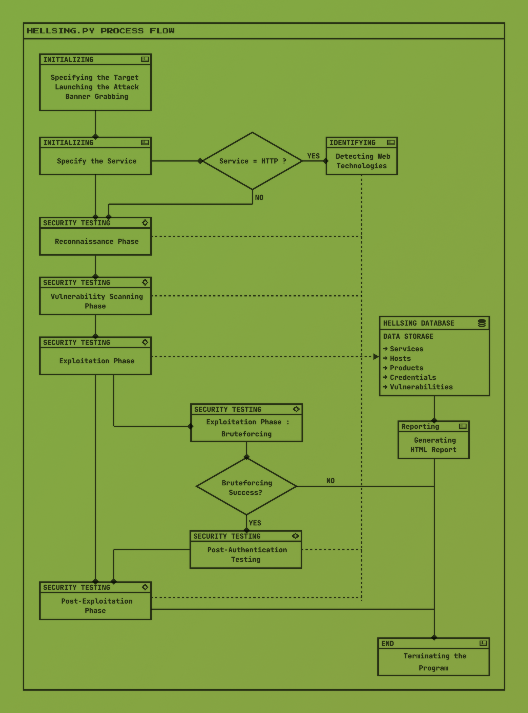

.. raw:: html

   <h1 align="center">

.. raw:: html

    
   hellsing.py v 0.0
    

.. .. image:: https://img.shields.io/badge/python-3.6-blue.svg
..     :target: https://www.python.org/downloads/release/python-366/
..     :alt: Python 3.6

.. .. image:: https://readthedocs.org/projects/jok3r/badge/?version=latest
..    :target: https://jok3r.readthedocs.io/en/latest/
..    :alt: Documentation ReadTheDocs

.. .. image:: https://img.shields.io/microbadger/image-size/koutto/jok3r.svg
..     :target: https://hub.docker.com/r/koutto/jok3r/
..     :alt: Docker Size

.. .. image:: https://img.shields.io/docker/cloud/build/koutto/jok3r.svg
..     :alt: Docker Build Status

.. raw:: html

   </h1>
   <h3 align="center">A Web Pentesting Automation Suite</h3>

.. contents:: 
    :local:
    :depth: 1

=============
Introduction
=============
**hellsing.py** is a web penetration testing automation CLI tool which is created using Python3 language.

It's integrating more than 40+ open-source CLI tools and various scripts. Designed for both security professionals and passionate enthusiasts, 
it offers a streamlined approach to web security testing. From probing the digital fortress to exploit web systems upon vulnerabilities.

Hellsing.py is a comprehensive arsenal for security assesment as it is designed to automate the process of security 
testing and it helps the security professionals to save time and effort of manually testing the security of web applications.

=============
Features
=============

Pentest Toolbox management
--------------------------
* **Install, update, uninstall and check the status of the tools in the toolbox.**
* **Install all the tools in the toolbox.**
* **Install specific tool(s) in the toolbox.**
* **Update all the tools in the toolbox.**
* **Update specific tool(s) in the toolbox.**
* **Uninstall all the tools in the toolbox.**
* **Uninstall specific tool(s) in the toolbox.**
* **Check the status of all the tools in the toolbox.**
* **Check the operational status of the tools in the toolbox.**

Web Security Assessment
-----------------------
* **Run all security checks against a URL.**
* **Run all security checks against an IP address.**
* **Specify the target port.**
* **Run only checks in specified category(ies).**
* **Run all checks except the ones in specified category(ies).**
* **Run security checks using a pre-defined attack profile.**
* **Add/Update the target into a given task scope.**

Local Database & Reporting
--------------------------
* **Create a new task in the local database.**
* **Select a task.**
* **Display services, hosts, detected products, found credentials and found vulnerabilities in the selected task.**
* **Generate a HTML report for the selected task.**

============
Architecture
============
.. .. image:: ./pictures/visio/flowchart/jok3r-flow-chart.svg
..     :alt: hellsing.py architecture

============
Installation
============
** To install just clone the git repository and run the setup script.**

1. **Clone the git repository:**

    .. code-block:: console

        git clone https://github.com/d3ttl4ff/hellsing.git

2. **Run the dependency installation script:**

    .. code-block:: console

        cd hellsing
        sudo ./install.sh

3. **Run the tool:**

    .. code-block:: console

        python3 hellsing.py -h

============
Update
============

**In order to update, just pull the latest version of the tool from git repository.**

.. code-block:: console

    sudo git pull

.. -----------------------------------------------------------------------------
Debugging
-----------

* Show options (help):

.. code-block:: console

    python3 hellsing.py -h

.. -----------------------------------------------------------------------------
Toolbox Management
-----------

* Show toolbox help menu:

.. code-block:: console

    python3 hellsing.py toolbox -h

* Show all the tools in the toolbox:

.. code-block:: console

    python3 hellsing.py toolbox --show-all	

* Install all the tools in the toolbox:

.. code-block:: console

    python3 hellsing.py toolbox --install-all

* Install specific tool(s) in the toolbox:

.. code-block:: console

    python3 hellsing.py toolbox --install ‘tool1,tool2,…’	

* Update all the tools in the toolbox:

.. code-block:: console

    python3 hellsing.py toolbox --update-all

* Update specific tool(s) in the toolbox:

.. code-block:: console

    python3 hellsing.py toolbox --update-tool ‘tool1,tool2,…’

* Uninstall all the tools in the toolbox:

.. code-block:: console

    python3 hellsing.py toolbox --uninstall-all

* Uninstall specific tool(s) in the toolbox:

.. code-block:: console

    python3 hellsing.py toolbox --uninstall-tool ‘tool1,tool2,…’

* Check the status of all the tools in the toolbox:

.. code-block:: console

    python3 hellsing.py toolbox --show-all

* Check the operational status of the tools in the toolbox:

.. code-block:: console

    python3 hellsing.py toolbox --check-all

.. -----------------------------------------------------------------------------
Security Assessment
----------------

* Show security assessment help menu:

.. code-block:: console

    python3 hellsing.py attack -h

* Run all security checks against a URL:

.. code-block:: console

    python3 hellsing.py attack -t [URL]

* Run all security checks against an IP address:

.. code-block:: console

    python3 hellsing.py attack -t [IP]

* Specify the target port:

.. code-block:: console

    python3 hellsing.py attack -t [URL/IP]:[PORT]

* Run only checks in specified category(ies):

.. code-block:: console

    python3 hellsing.py attack -t [URL] --run-only [CAT1,CAT2,…]

* Run all checks except the ones in specified category(ies): 

.. code-block:: console

    python3 hellsing.py attack -t [URL] --run-exclude [CAT1,CAT2,…]

* Run security checks using a pre-defined attack profile:

.. code-block:: console

    python3 hellsing.py attack -t [URL] --profile [PROFILE_NAME]

* Add/Update the target into a given task scope:

.. code-block:: console

    python3 hellsing.py attack -t [URL] --addop [TASK_NAME]
.. -----------------------------------------------------------------------------
**Usage examples:** 

* Example 1: Run all security checks against a URL:

.. code-block:: console

    python3 hellsing.py attack -t http://example.com

* Example 2: Run all security checks against an IP address:

.. code-block:: console

    python3 hellsing.py attack -t 0.0.0.0

* Example 3: Run all security checks against a URL and specify the target port:

.. code-block:: console

    python3 hellsing.py attack -t http://example.com:8080

* Example 4: Run only checks in specified category(ies):

.. code-block:: console

    python3 hellsing.py attack -t http://example.com --run-only recon,vulnlscan

* Example 5: Add/Update the target into a given task scope:

.. code-block:: console

    python3 hellsing.py attack -t http://example.com --addop [castle]

.. -----------------------------------------------------------------------------
Database and Reporting
----------------

* Show database help menu:

.. code-block:: console

    python3 hellsing.py db -h

* Create a new task in the local database:

.. code-block:: console

    python3 hellsing.py db 

    helldb[default]> task -a [TASK_ID] 

    [+] Task “bayonet” successfully added 
    [*] Selected task is now bayonet 

    helldb[TASK_ID]>

* Select a task:

.. code-block:: console

    python3 hellsing.py db 

    helldb[default]> task [TASK_ID] 

    [+] Selected task is now [TASK_ID] 
    [*] Task “[TASK_ID]” does not exist

* Display services, hosts, detected products, found credentials and found vulnerabilities in the selected task:

.. code-block:: console

    helldb[TASK_ID]> services
    helldb[TASK_ID]> hosts 
    helldb[TASK_ID]> products
    helldb[TASK_ID]> creds 
    helldb[TASK_ID]> vulns

* Generate a HTML report for the selected task: 

.. code-block:: console

    helldb[TASK_ID]> report

.. -----------------------------------------------------------------------------
=====================================
Security Checks Categories 
=====================================

**Updated on: 17/03/2024**

-  `recon`_
-  `vulnscan`_
-  `exploit`_
-  `bruteforce`_
-  `discovery`_
-  `postexploit`_
-  `report`_

.. -----------------------------------------------------------------------------
=====================================
Supported Services & Security Checks 
=====================================

**Updated on: 17/03/2024**

-  `HTTP (default 80/tcp)`_
-  `HTTPS (default 443/tcp)`_

.. -----------------------------------------------------------------------------
HTTP (default 80/tcp)
---------------------

.. code-block:: console

    +------------------------------------------+--------------+------------------------------------------------------------------------------------------------+-------------------------------+
    | Name                                     | Category     | Description                                                                                    | Tool used                     |
    +------------------------------------------+--------------+------------------------------------------------------------------------------------------------+-------------------------------+
    | nmap-recon                               | recon        | Recon using Nmap HTTP scripts                                                                  | nmap                          |
    | load-balancing-detection                 | recon        | HTTP load balancer detection                                                                   | halberd                       |
    | waf-detection                            | recon        | Identify and fingerprint WAF products protecting website                                       | wafw00f                       |
    | waf-detection2                           | recon        | Identify and fingerprint WAF products protecting website                                       | identifywaf                   |
    | cloudmare-recon                          | recon        | CloudFlare real IP catcher                                                                     | cloudmare                     |
    | fingerprinting-multi-whatweb             | recon        | Identify CMS, blogging platforms, JS libraries, Web servers                                    | whatweb                       |
    | fingerprinting-appserver                 | recon        | Fingerprint application server (JBoss, ColdFusion, Weblogic, Tomcat, Railo, Axis2, Glassfish)  | clusterd                      |
    | webdav-detection-msf                     | recon        | Detect WebDAV on webserver                                                                     | metasploit                    |
    | fingerprinting-multi-wig                 | recon        | Fingerprint several CMS and web/application servers                                            | wig                           |
    | fingerprinting-cms-cmseek                | recon        | Detect CMS (130+ supported), detect version on Drupal, advanced scan on Wordpress/Joomla       | cmseek                        |
    | fingerprinting-cms-fingerprinter         | recon        | Fingerprint precisely CMS versions (based on files checksums)                                  | fingerprinter                 |
    | fingerprinting-drupal                    | recon        | Fingerprint Drupal 7/8: users, nodes, default files, modules, themes enumeration               | drupwn                        |
    | fingerprinting-domino                    | recon        | Fingerprint IBM/Lotus Domino software                                                          | domiowned                     |
    | crawling-fast                            | recon        | Crawl website quickly, analyze interesting files/directories                                   | dirhunt                       |
    | crawling-fast2                           | recon        | Crawl website and extract URLs, files, intel & endpoints                                       | photon                        |
    | vulners-lookup                           | vulnlookup   | Vulnerabilities lookup (language, framework, jslib, cms, server, appserver) on Vulners.com     | vulners-lookup                |
    | cvedetails-lookup                        | vulnlookup   | Vulnerabilities lookup (language, framework, jslib, cms, server, appserver) on Cvedetails.com  | cvedetails-lookup             |
    | default-creds-web-multi                  | defaultcreds | Check for default credentials on various web interfaces                                        | changeme                      |
    | default-creds-appserver                  | defaultcreds | Check for default/common credentials on appservers                                             | web-brutator                  |
    | ssl-check                                | vulnscan     | Check for SSL/TLS configuration                                                                | testssl                       |
    | headers-analysis                         | vulnscan     | Check HTTP headers                                                                             | h2t                           |
    | vulnscan-multi-nikto                     | vulnscan     | Check for multiple web vulnerabilities/misconfigurations                                       | nikto                         |
    | webdav-scan-davscan                      | vulnscan     | Scan HTTP WebDAV                                                                               | davscan                       |
    | webdav-internal-ip-disclosure            | vulnscan     | Check for WebDAV internal IP disclosure                                                        | metasploit                    |
    | webdav-website-content                   | vulnscan     | Detect webservers disclosing its content through WebDAV                                        | metasploit                    |
    | http-put-check                           | vulnscan     | Detect the support of dangerous HTTP PUT method                                                | metasploit                    |
    | apache-optionsbleed-check                | vulnscan     | Test for the Optionsbleed bug in Apache httpd (CVE-2017-9798)                                  | optionsbleed                  |
    | shellshock-scan                          | vulnscan     | Detect if web server is vulnerable to Shellshock (CVE-2014-6271)                               | shocker                       |
    | iis-shortname-scan                       | vulnscan     | Scan for IIS short filename (8.3) disclosure vulnerability                                     | iis-shortname-scanner         |
    | iis-internal-ip-disclosure               | vulnscan     | Check for IIS internal IP disclosure                                                           | metasploit                    |
    | tomcat-user-enum                         | vulnscan     | Enumerate users on Tomcat 4.1.0-4.1.39, 5.5.0-5.5.27 and 6.0.0-6.0.18                          | metasploit                    |
    | jboss-vulnscan-multi                     | vulnscan     | Scan JBoss application server for multiple vulnerabilities                                     | metasploit                    |
    | jboss-status-infoleak                    | vulnscan     | Queries JBoss status servlet to collect sensitive information (JBoss 4.0, 4.2.2 and 4.2.3)     | metasploit                    |
    | jenkins-infoleak                         | vulnscan     | Enumerate a remote Jenkins-CI installation in an unauthenticated manner                        | metasploit                    |
    | cms-multi-vulnscan-cmsmap                | vulnscan     | Check for vulnerabilities in CMS Wordpress, Drupal, Joomla                                     | cmsmap                        |
    | wordpress-vulnscan                       | vulnscan     | Scan for vulnerabilities in CMS Wordpress                                                      | wpscan                        |
    | wordpress-vulnscan2                      | vulnscan     | Scan for vulnerabilities in CMS Wordpress                                                      | wpseku                        |
    | joomla-vulnscan                          | vulnscan     | Scan for vulnerabilities in CMS Joomla                                                         | joomscan                      |
    | joomla-vulnscan2                         | vulnscan     | Scan for vulnerabilities in CMS Joomla                                                         | joomlascan                    |
    | joomla-vulnscan3                         | vulnscan     | Scan for vulnerabilities in CMS Joomla                                                         | joomlavs                      |
    | drupal-vulnscan                          | vulnscan     | Scan for vulnerabilities in CMS Drupal                                                         | droopescan                    |
    | magento-vulnscan                         | vulnscan     | Check for misconfigurations in CMS Magento (working partially)                                 | magescan                      |
    | silverstripe-vulnscan                    | vulnscan     | Scan for vulnerabilities in CMS Silverstripe                                                   | droopescan                    |
    | vbulletin-vulnscan                       | vulnscan     | Scan for vulnerabilities in CMS vBulletin                                                      | vbscan                        |
    | liferay-vulnscan                         | vulnscan     | Scan for vulnerabilities in CMS Liferay                                                        | liferayscan                   |
    | angularjs-csti-scan                      | vulnscan     | Scan for AngularJS Client-Side Template Injection                                              | angularjs-csti-scanner        |
    | jquery-fileupload-rce-cve2018-9206       | exploit      | Exploit arbitrary file upload in jQuery File Upload widget <= 9.22 (CVE-2018-9206)             | jqshell                       |
    | struts2-rce-cve2017-5638                 | exploit      | Exploit Apache Struts2 Jakarta Multipart parser RCE (CVE-2017-5638)                            | jexboss                       |
    | struts2-rce-cve2017-9791                 | exploit      | Exploit Apache Struts2 Plugin Showcase OGNL RCE (CVE-2017-9791)                                | metasploit                    |
    | struts2-rce-cve2017-9805                 | exploit      | Exploit Apache Struts2 REST Plugin XStream RCE (CVE-2017-9805)                                 | struts-pwn-cve2017-9805       |
    | struts2-rce-cve2018-11776                | exploit      | Exploit Apache Struts2 misconfiguration RCE (CVE-2018-11776)                                   | struts-pwn-cve2018-11776      |
    | rails-rce-cve2019-5420                   | exploit      | Exploit File Content Disclosure (CVE-2019-5418) + RCE (CVE-2019-5420) On Ruby on Rails         | jok3r-pocs                    |
    | appserver-auth-bypass                    | exploit      | Attempt to exploit authentication bypass on appservers                                         | clusterd                      |
    | tomcat-rce-cve2017-12617                 | exploit      | Exploit for Apache Tomcat JSP Upload Bypass RCE (CVE-2017-12617)                               | jok3r-pocs                    |
    | jboss-misconfig-exploit                  | exploit      | Try exploit misconfig on JBoss appserver pre-auth (jmx|web|admin-console,JMXInvokerServlet)    | jexboss                       |
    | jboss-path-traversal-cve2014-7816        | exploit      | Exploit path traversal on Jboss Wildfly 8.1.0 (only Windows) (CVE-2014-7816)                   | metasploit                    |
    | jboss-deserialize-cve2015-7501           | exploit      | Exploit for JBoss Deserialize RCE (CVE-2015-7501)                                              | jok3r-pocs                    |
    | glassfish-path-traversal-cve2017-1000028 | exploit      | Exploit path traversal on Glassfish <= 4.1 (CVE-2017-1000028)                                  | metasploit                    |
    | jenkins-unauthenticated-console          | exploit      | Detect and exploit unauthenticated Jenkins-CI script console                                   | metasploit                    |
    | jenkins-cli-deserialize-cve2015-8103     | exploit      | Exploit Java deserialization (unauthenticated) in Jenkins CLI RMI (CVE-2015-8103)              | jexboss                       |
    | jenkins-cli-deserialize2-cve2015-8103    | exploit      | Exploit Java deserialization (unauthenticated) in Jenkins CLI RMI (CVE-2015-8103)              | jok3r-pocs                    |
    | jenkins-groovy-xml-rce-cve2016-0792      | exploit      | Exploit Jenkins Groovy XML RCE (CVE-2016-0792)                                                 | jok3r-pocs                    |
    | jenkins-deserialize-cve2017-1000353      | exploit      | Exploit Jenkins Java Deserialize RCE (CVE-2017-1000353)                                        | jok3r-pocs                    |
    | jenkins-rce-cve2018-1000861              | exploit      | Exploit Jenkins unauthenticated RCE via method invokation (CVE-2018-1000861)                   | jok3r-pocs                    |
    | weblogic-t3-open-jdbc-datasource         | exploit      | List JNDIs available thru Weblogic T3(s) and attempt to get SQL shell via open JDBC datasource | jndiat                        |
    | weblogic-t3-deserialize-cve2015-4852     | exploit      | Exploit Java deserialization (unauthenticated) in Weblogic T3(s) (CVE-2015-4852)               | jok3r-pocs                    |
    | weblogic-t3-deserialize-cve2016-3510     | exploit      | Exploit Java deserialization (unauthenticated) in Weblogic T3 (CVE-2016-3510)                  | jok3r-pocs                    |
    | weblogic-t3-deserialize-cve2017-3248     | exploit      | Exploit Java deserialization (unauthenticated) in Weblogic T3(s) (CVE-2017-3248)               | exploit-weblogic-cve2017-3248 |
    | weblogic-t3-deserialize-cve2018-2628     | exploit      | Exploit Java deserialization (unauthenticated) in Weblogic T3(s) (CVE-2018-2628)               | jok3r-pocs                    |
    | weblogic-t3-deserialize-cve2018-2893     | exploit      | Exploit Java deserialization (unauthenticated) in Weblogic T3(s) (CVE-2018-2893)               | jok3r-pocs                    |
    | weblogic-rce-cve2018-2894                | exploit      | Exploit vulnerability in Weblogic allowing webshell deploiement (CVE-2018-2894)                | jok3r-pocs                    |
    | weblogic-wls-wsat-cve2017-10271          | exploit      | Exploit WLS-WSAT (unauthenticated) in Weblogic (CVE-2017-10271)                                | jok3r-pocs                    |
    | websphere-deserialize-cve2015-7450       | exploit      | Exploit Java deserialization (unauthenticated) in Websphere (CVE-2015-7450)                    | jok3r-pocs                    |
    | coldfusion-xxe-cve2009-3960              | exploit      | Exploit XXE in Coldfusion 7/8/9 (CVE-2009-3960)                                                | metasploit                    |
    | coldfusion-path-traversal-cve2010-2861   | exploit      | Exploit path traversal in Coldfusion (CVE-2010-2861)                                           | metasploit                    |
    | coldfusion-path-traversal-cve2013-3336   | exploit      | Exploit path traversal in Coldfusion 9/10 and extract creds (CVE-2013-3336)                    | metasploit                    |
    | iis-webdav-win2003-bof                   | exploit      | Exploit Buffer overflow in WebDAV in IIS 6.0 on Windows 2003 R2 (CVE-2017-7269)                | metasploit                    |
    | drupal-sqli-drupalgeddon                 | exploit      | Exploit Drupalgeddon SQLi to add an admin in CMS Drupal 7.x <= 7.31 (CVE-2014-3704)            | jok3r-pocs                    |
    | drupal-rce-drupalgeddon2                 | exploit      | Exploit Drupalgeddon2 RCE in CMS Drupal 7.x < 7.58 & 8.x < 8.1 (CVE-2018-7600)                 | drupwn                        |
    | drupal-rce-rest-cve2019-6340             | exploit      | Exploit REST RCE in CMS Drupal 8.5.x < 8.5.11 & 8.6.x < 8.6.10 (CVE-2019-6340)                 | drupwn                        |
    | joomla-comfields-sqli-rce                | exploit      | Exploit SQL injection to RCE in com_fields component in Joomla >= 3.7.0 (CVE-2017-8917)        | metasploit                    |
    | bruteforce-htaccess                      | bruteforce   | Bruteforce HTTP authentication (htaccess) if 401 Unauthorized returned                         | web-brutator                  |
    | bruteforce-appserver                     | bruteforce   | Bruteforce authentication on appserver (if no lockout by default)                              | web-brutator                  |
    | bruteforce-domino                        | bruteforce   | Bruteforce authentication on IBM/Lotus Domino software                                         | domiowned                     |
    | bruteforce-wordpress                     | bruteforce   | Bruteforce Wordpress accounts (require detected username(s))                                   | wpseku                        |
    | bruteforce-joomla                        | bruteforce   | Bruteforce Joomla "admin" account                                                              | xbruteforcer                  |
    | bruteforce-drupal                        | bruteforce   | Bruteforce Drupal "admin" account                                                              | xbruteforcer                  |
    | bruteforce-opencart                      | bruteforce   | Bruteforce Opencart "admin" account                                                            | xbruteforcer                  |
    | bruteforce-magento                       | bruteforce   | Bruteforce Magento "admin" account                                                             | xbruteforcer                  |
    | discovery-server                         | discovery    | Bruteforce web paths specific to detected web/application servers                              | dirsearch                     |
    | discovery-cms                            | discovery    | Bruteforce web paths specific to detected CMS                                                  | dirsearch                     |
    | discovery-language-directories           | discovery    | Bruteforce web paths specific to detected language and directories                             | dirsearch                     |
    | discovery-general                        | discovery    | Bruteforce web paths related to config, database, static files, misc...                        | dirsearch                     |
    | appserver-postauth-deploy                | postexploit  | Deploy a webshell on appserver (require credentials)                                           | clusterd                      |
    | wordpress-shell-upload                   | postexploit  | Upload shell on Wordpress (require admin credentials)                                          | wpforce                       |
    +------------------------------------------+--------------+------------------------------------------------------------------------------------------------+-------------------------------+

